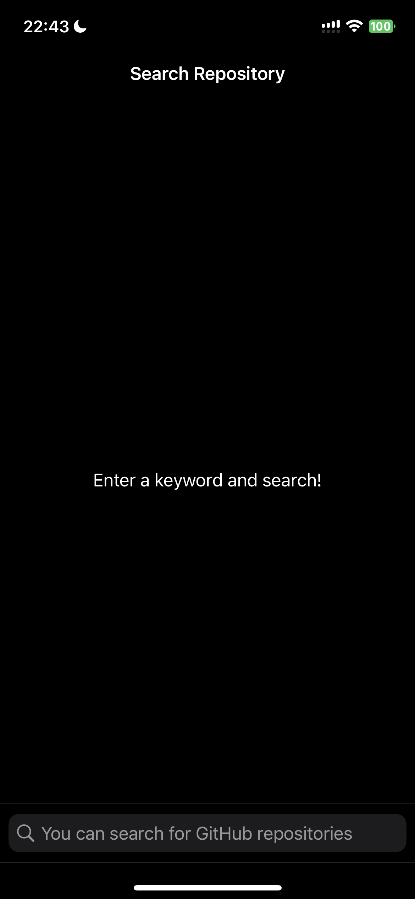
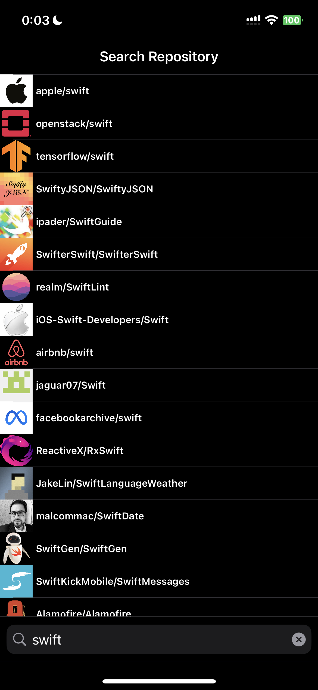
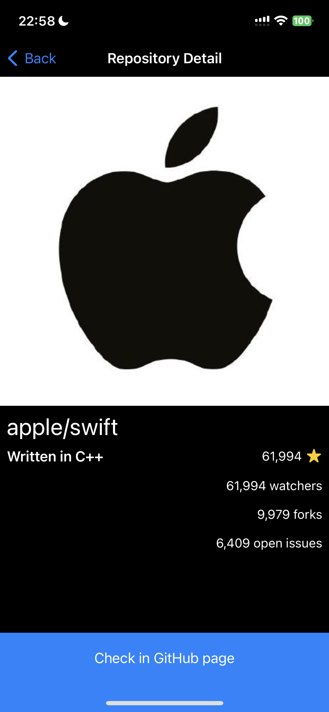
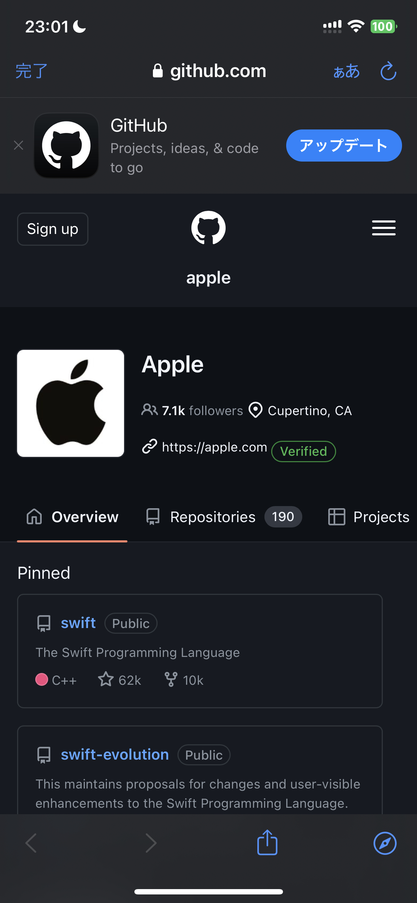
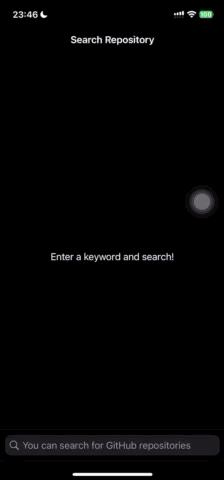
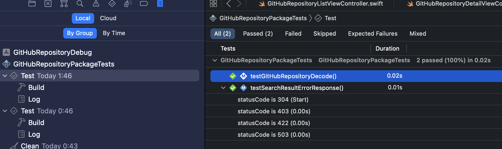
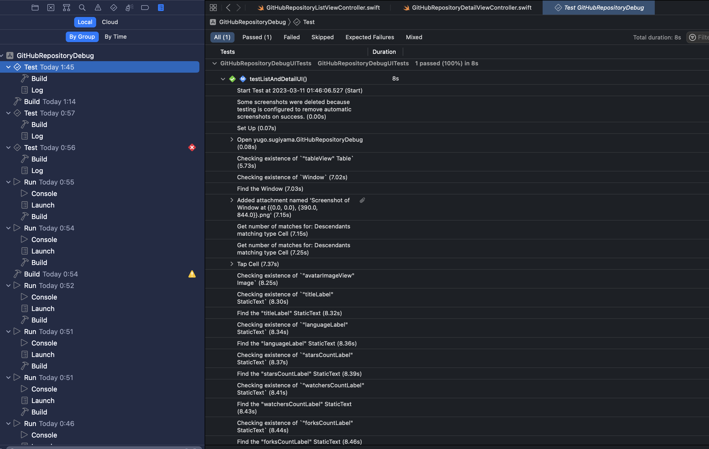
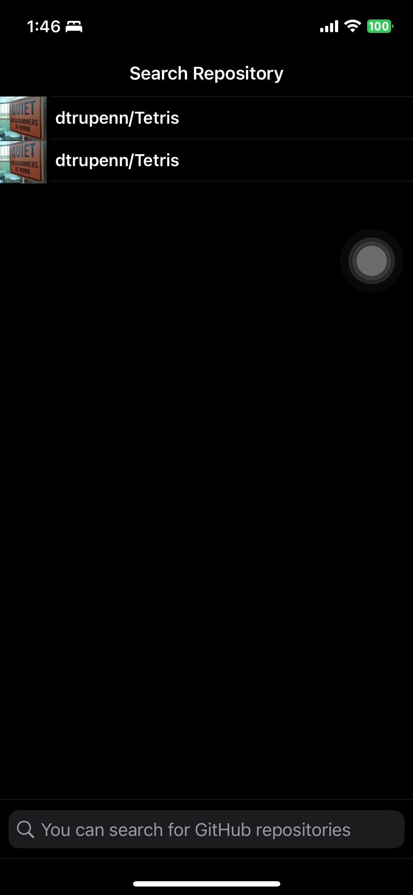
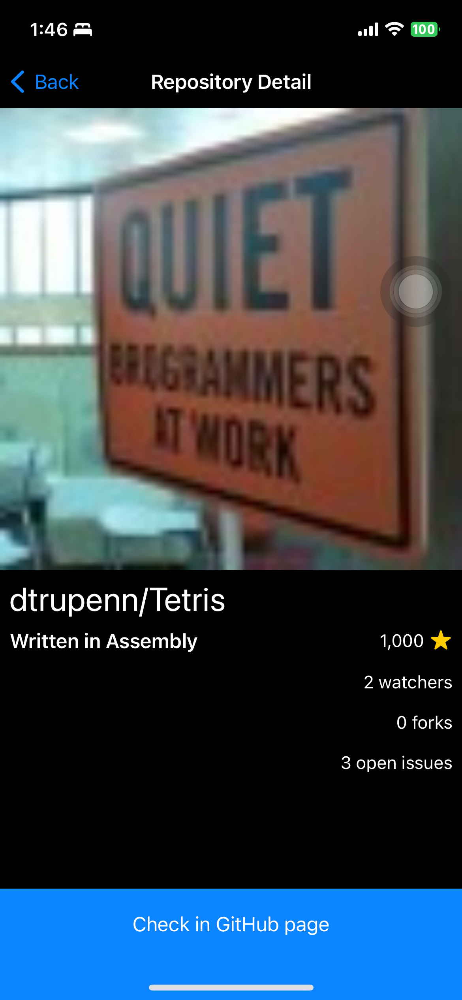

# Coding task
## Summary

This app is to search GitHub repositories.

### Device capture

### Environment

- IDE：Xcode 14.1
- Swift：5.7.2
- OS version target：iOS 16.1 / iPadOS16.1(optimization for iPad is not ready)

### Behavior

1. Enter some keyword
2. Search repositories with the GitHub API (`search/repositories`) and display the result list as an overview (repository name)
    - when searching, user can use incremental search.
3. After selecting a specific result, display the details of the corresponding repository (repository name, owner icon, project language, Star count, Watcher count, Fork count, Issue count)
4. Tap the button at the bottom of the details screen to display the repository details screen in SafariViewController.

### Architecture
1. This app uses `MVVM` architecture.
2. In page navigation, uses `Coordinator` pattern.
3. This app has multiple modules in Local SPM package.
    1. GitHubRepositoryList: List page
    2. GitHubRepositoryDetail: Detail page 
    3. GitHubRepositoryCore: Common codes
    4. GitHubRepositoryBase: Put list and detail together
    5. GitHubRepositoryTestCore: Common codes for test

### Other features
1. This app uses `SwiftUI` components partially(in TableViewCell in GitHubRepositoryList)
2. This app has two app targets(we can put different GoogleInfoService.plist in each target when using Firebase)
    1. for Debug
    2. for Release
3. Dark mode support
4. Localize(English and Japanese) support
5. DI Support(This app uses `Dependencies` to manage DI)
6. Some UI ingenuity
    1. This app has a SearchBar bottom - user can easily touch searchBar component even if device is very large.
    2. about integer items, display these items with commna like `1,234`
7. This app implements `UnitTest` and `UITest`.

### UnitTest/UITest evidences
#### UnitTest

#### UITest

##### Captured automatically in UITest

